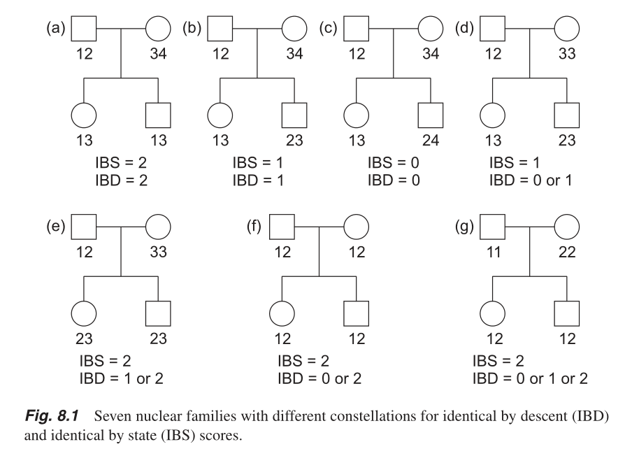
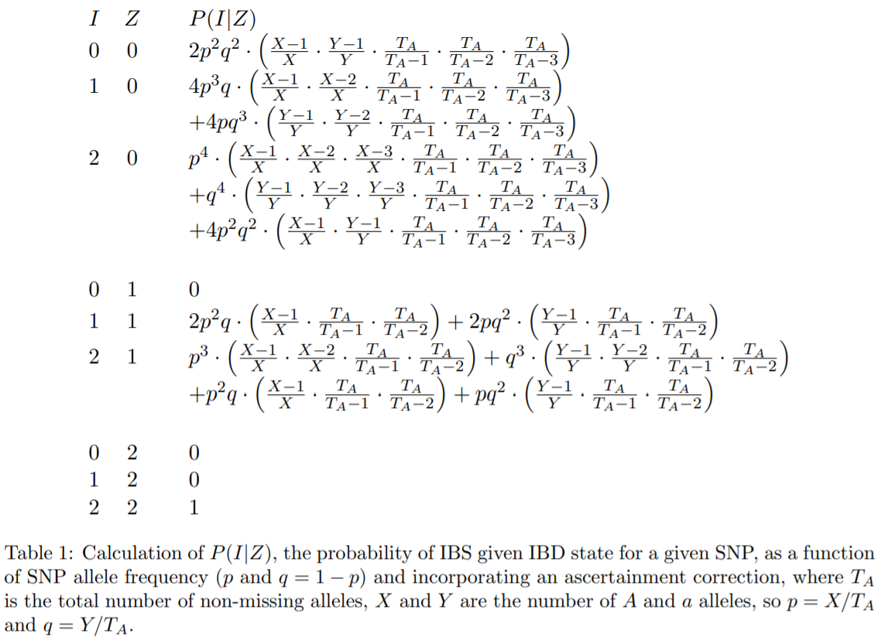

GWAS (Genome-wise association study) is the way to find disease-relate-variants.

As a prior to analyze data, QC (quality control) is needed.

I have been using [**plink**](https://www.cog-genomics.org/plink/2.0/) and **python** for QC.

If you have *vcf* files instead of plink formated files, then convert the *vcf* to *bed*.

```
$ plink2 --vcf data.vcf --set-missing-var-ids @_#_\$r_\$a --new-id-max-allele-len 100 --make-bed --out data
or
$ plink2 --vcf data.vcf.gz --set-missing-var-ids @_#_\$r_\$a --new-id-max-allele-len 100 --make-bed --out data
```
- `@` : chromosome
- `#` : position
- `\$r` : reference allele
- `\$a` : alt allele


After the files are ready, let us follow the regular procedure for GWAS.

# Missingness
- Remove missing variants and samples alternately from 0.1 to 0.01.
```
$ plink2 --bfile raw_data --geno (0.1~0.01) --make-bed --out ft_missing
$ plink2 --bfile ft_missing --mind (0.1~0.01) --make-bed --out ft_missing
```

# Relatives
- Remove all first-degree relations.
```
$ plink2 --bfile ft_missing --king-cutoff 0.177 --make-bed --out ft_pedigree 
```
- Duplicate/MZ twin : > 0.354
- First-degree  : [0.177, 0.354]
- Second-degree : [0.0884, 0.177]
- Third-degree  : [0.0442, 0.0884]

# Variant distribution
- Check the number of variants at each frequencies.
```
$ plink2 --bfile ft_pedigree --freq alt1bins=0.01,0.02,0.03,0.04,0.05,0.1,0.2,0.3,0.4,0.5,0.6,0.7,0.8,0.9,1
  : plink2.afreq.alt1.bins
```
- The ranges are `[0,0.01)`, `[0.01,0.02)`,...,`[0.4,0.5]`,`(0.5,0.6]`,...,`[0.8,0.9)`,`1`.

# MAF
- Remove low maf variants less than 0.01.
```
$ plink2 --bfile ft_pedigree --maf 0.01 --make-bed --out ft_maf
```

# HWE
- Remove genotyping error.(p-value < 1e-50)
```
$ plink2 --bfile ft_maf --hwe 1e-50 keep-fewhet --make-bed --out ft_hwe_gt
```

- Remove HWE p-value less than 1e-5.
```
$ plink2 --bfile ft_hwe_gt --hwe 1e-5 keep-fewhet --make-bed --out ft_hwe
```
- `keep-fewhet` : When significant population stratification is present, this test can be expected to fail in the too-few-hets direction on some normal variants. When using --hwe for quality control, you probably want to keep these variants.

Reference
- [Testing for Hardy-Weinberg equilibrium at biallelic genetic markers on the X chromosome.](https://www.ncbi.nlm.nih.gov/pmc/articles/PMC4868269/)
- [The mid p-value in exact tests for Hardy-Weinberg equilibrium.](https://www.degruyter.com/view/journals/sagmb/12/4/article-p433.xml)

If you want to see case or control only,
```
$ plink2 --bfile ft_hwe_gt --hwe 1e-5 keep-fewhet --keep-if "PHENO1==control" --make-bed --out ft_hwe
```

# Linkage disequilibrium
: In population genetics, linkage disequilibrium is the non-random association of alleles at different loci in a given population.[WIKIPEDIA]
```
$ plink2 --bfile ft_hwe --indep-pairwise 1000 100 0.2  # do not care the chromosome.
$ plink2 --bfile ft_hwe --indep-chr 1000 100 0.2  # do not care the chromosome.
  : plink2.prune.in , plink2.prune.out
  
$ plink2 --bfile ft_hwe --extract plink2.prune.in --make-bed --out ft_ld
```
- Recombination unit is CM(centi-morgan). It is approximately 1 Mb. So LD should be within the size.


```
$ plink --bfile ft_hwe --r2 dprime with-freqs --ld-window 999999 --ld-window-kb 1000 --ld-window-r2 0.2 --out ft_ld
```

- Check the correlation between SNPs.

# Sex info
```
$ plink --file sample5 --check-sex
```
- Male (1) : XHE > 0.80
- Female (2) : XHE < 0.20
- No sex (0) : 0.20 < XHE < 0.80


# Inbreeding : F
```
$ plink --bfile sample5 -het
  : plink.het
```
* F=(observed hom. count - expected count) / (total observations - expected count)
  
<https://www.cog-genomics.org/plink/1.9/formats#het>

# Heterozygosity : |f| = (1-O/E) < 0.1
```
$ plink --bfile sample5 --hardy
  : plink.hwe
```
In 'plink.hwe',  there are observed and expected frequencies of heterozygosity for each variants.
```
import pandas as pd

df=pd.read_csv('plink.hwe', sep='\s+')

df['F']=1-df['O(HET)']/df['E(HET)']
df['abs(F)']=abs(df['F'])
df=df[df['abs(F)'] < 0.1]
df_snp=df['SNP']
df_snp.to_csv('hetero_prun.out',index=False)
```
```
$ plink --bfile sample5 --extract hetero_prun.out --recode --out hetero_prun
  : hetero_prun.ped + hetero_prun.map
```

# LD : R2 > 0.2
```
$ plink --file hetero_prun --r2 dprime inter-chr with-freqs --ld-window-r2 0.2
  : plink.ld
```
- Association is the relation between an allele and a phenotype, whereas LD refers to the relation between two alleles or to the relation between two genotypes.

# LD pruning
```
$ plink --file data --indep 50 5 2  # window size, step, the VIF(variance inflation factor) threshold: 1/(1-R^2)
$ plink --file data --indep-pairwise 50 5 0.5  # window size, step, R2 threshold
$ plink --file data --extract plink.prune.in --make-bed --out pruneddata
```
<http://zzz.bwh.harvard.edu/plink/summary.shtml#prune>

- Size : to compute R2 with nearest 50 SNPs, 50C2
- Step : next 5th SNP
- VIF = 1 : completely independent
- VIF = 2~10 : usual cut-off
- R2 : to remove SNPs if R2 is not less than 0.5
> - plink.prune.in : R2 < 0.5
> - plink.prune.out : R2 >= 0.5


# IBD : PI-HAT > 0.2
: It requires at least 1000 independent SNPs.

- Identical twins, and duplicates, are 100%identical by descent (Pihat 1.0)
- First-degree relatives are 50% IBD (Pihat 0.5)
- Second-degree relatives are 25% IBD (Pihat 0.25)
- Third-degree relatives are 12.5% equal IBD (Pihat 0.125)
```
$ plink --file hetero_prun --genome --genome-full --min 0.2 # --max 0.5
  : plink.genome
```
```
import pandas as pd

df=pd.read_csv('plink.genome',sep='\s+')

ys, xs, patches=plt.hist(df['PI_HAT'].values,bins=[0,0.125,0.25,0.5,1],rwidth=0.8)
for i in range(0, len(ys)):
    plt.text(x=xs[i], y=ys[i],
             s=int(ys[i]),#s='{:0>4.1f}%'.format(ys[i]),
             fontsize=8,
             color='red')
y_min, y_max = plt.ylim()
plt.ylim(y_min, y_max+0.05)
plt.yticks([])
plt.xticks([0,0.125,0.25,0.5,1],fontsize=6)
plt.grid(ls='--',alpha=0.6)    
plt.show()
```
**Ex)** Z(IBD) = (0.4106, 0.0444, 0.5450), PI_HAT = 0.5672, IBS_DIST = 0.943380, IBS = (6, 53, 515)

- IBS (Identity by State) vs IBD (Identity by Descent)

> : Chapter 8 in [A Statistical Approach to Genetic Epidemiology: With Access to E‐Learning Platform by Friedrich Pahlke, 2nd ed](https://onlinelibrary.wiley.com/doi/book/10.1002/9783527633654).

- P(IBD=0)=N(IBS=0)/N(IBS=0|IBD=0)
- P(IBD=1)=[N(IBS=1)-P(IBD=0)N(IBS=1|IBD=0)]/N(IBS=1|IBD=1)
- P(IBD=2)=[N(IBS=2)-P(IBD=1)N(IBS=2|IBD=1)-P(IBD=0)N(IBS=2|IBD=0)]/N(IBS=2|IBD=2)


> : p12 in [PLINK: A Tool Set for Whole-Genome Association and Population-Based Linkage Analyses](https://www.ncbi.nlm.nih.gov/pmc/articles/PMC1950838/).


- The IBS method works best when only independent SNPs are included in the analysis.
- Independent SNP set for IBS calcuation is generally prepared by removing regions of extended LD and pruning the remaining regions so that no pair of SNPs within a given window (say, 50kb) is correlated.
- Related individuals will share more alleles IBS than expected by chance, with the degree of additional sharing proportional to the degree of relatedness.
<http://www.bioinf.wits.ac.za/courses/gwas/OLD/Qc_combined_final.pdf> P.18


# PCA (take clustered data)
```

```

# HWE : p < 1E-5
in controls.

- One way to find genotyping errors.
- Deviation from HWE may also be due to precesses related to disease, and in genenral it is best not to discard SNPs that are only mildly discordant with HWE, but only to flag them for extra checking if they do who association with phenotype.

- HWE holds only under the following assumption,
> - Random mating.
> - No selection or migration.
> - No mutation.
> - No population stratification.
> - Infinite population size.

- [A Note on Exact Tests of Hardy-Weinberg Equilibrium, Janis E. Wigginton, David J. Cutler and Gonc¸alo R. Abecasis, Am. J. Hum. Genet. 76:887–883, 2005.](https://www.ncbi.nlm.nih.gov/pmc/articles/PMC1199378/)
> - Source code : <https://csg.sph.umich.edu/abecasis/Exact/index.html>
- [Eighty Years Ago: The Beginnings of Population Genetics, James F. Crow and William F. Dove, Genetics 119:473–476, 1988.](https://www.ncbi.nlm.nih.gov/pmc/articles/PMC1203431/)

Evidence for departure from HWE has been userd in many applications of discrete P-values in HWE testing.

- Inferring the existence of natural selection :
> - [Wallace, B., 1958 The comparison of observed and calculated zygotic distributions. Evolution 12: 113–115.](https://onlinelibrary.wiley.com/doi/abs/10.1111/j.1558-5646.1958.tb02935.x)
> - [Lewontin, R. C., and C. C. Cockerham, 1959 The goodness-of-fit test for detecting natural selection in random mating populations. Evolution 13: 561–564.](https://onlinelibrary.wiley.com/doi/abs/10.1111/j.1558-5646.1959.tb03043.x)
- Chanllenging the statistical analysis of forensic DNA profile :
> - [Cohen, J. E., M. Lynch and C. E. Taylor, 1991 Forensic DNA tests and Hardy-Weinberg equilibrium. Science 253: 1037–1038.](https://science.sciencemag.org/content/253/5023/1037.long)
> - [Weir, B. S., 1992 Population genetics in the forensic DNA debate. Proc. Natl. Acad. Sci. USA 89: 11654–11659.](https://www.ncbi.nlm.nih.gov/pmc/articles/PMC50614/)
- Detecting genotyping errors :
> - [Gomes, I., A. Collins, C. Lonjou, N. S. Thomas, J. Wilkinson et al., 1999 Hardy-Weinberg quality control. Ann. Hum. Genet. 63:
535–538.](https://onlinelibrary.wiley.com/doi/abs/10.1046/j.1469-1809.1999.6360535.x)
> - [Zou, G. Y., and A. Donner, 2006 The merits of testing Hardy-Weinberg equilibrium in the analysis of unmatched case-control data:
a cautionary note. Ann. Hum. Genet. 70: 921–933.](https://onlinelibrary.wiley.com/doi/abs/10.1111/j.1469-1809.2006.00267.x)


# After imputation
## Linear regression : R2 > 0.7
- The linear model regressing each imputed SNP on regional typed SNPs.

## MAF > 0.01

# Bonferonni-correction : p < 5E-8

# Q-Q plot
- To compare observed and expected quantities

#  LD Block

# Low quality SNP
- Genotype clusters of many SNPs demonstrate low quality genotyping due to:
> - Low DNA concentration
> - Poor binding and competitive binding by other sequences
> - Structural and copy number variants

# Reference
- A guide to genome-wide association analysis and post-analytic interrogation, <https://dx.doi.org/10.1002/sim.6605>
- GWAS QC-theory and steps, <http://www.bioinf.wits.ac.za/courses/gwas/OLD/Qc_combined_final.pdf>
