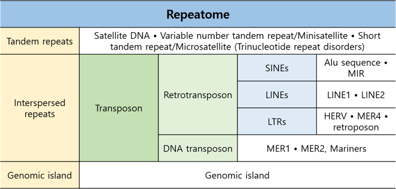

# Installation
```
$ sudo yum install libstdc++-static
$ sudo yum install glibc-static
$ sudo yum install git
$ git clone https://github.com/bedops/bedops.git
$ cd bedops
$ make
$ make install
$ sudo cp bin/* /usr/local/bin # optional
```
<https://bedops.readthedocs.io/>

# Check repeated region
```
$ wget -qO- http://hgdownload.cse.ucsc.edu/goldenpath/hg38/database/rmsk.txt.gz | gunzip -c -|awk -v OFS="\t" '{ print $6, $7, $8, $12, $11, $10 }' -|sort-bed - > rmsk.bed
$ sort-bed Exome-Agilent_V6_UTR_Padded.duplicate.merge.bed > Exome_regions.bed
$ bedmap --echo --echo-map-id-uniq Exome_regions.bed rmsk.bed > Exome_rm_regions.bed
```


<http://www.incodom.kr/RepeatMasker>

