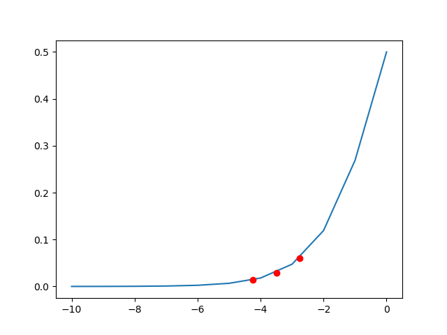
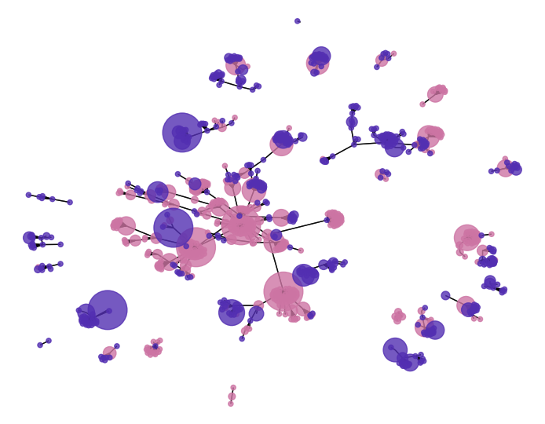

This analysis is based on HapMap 1000 genome data which is downloaded from below link :

<http://hgdownload.cse.ucsc.edu/gbdb/hg19/1000Genomes/phase3/>

- Data file : [ch78work.map](data/ch78work.map) , [ch78work.ped](data/ch78work.ped)

# Data manipulation

- Replace some column values to other values.
```
import pandas as pd
import numpy as np

bfile='out1.ped'

a=pd.read_csv(bfile,header = None,sep='\s+|\t+', index_col=0,engine='python')

add=np.array(range(1,a.shape[0]+1))
a[1]=add

print(a.head())

outFile='out_re.ped'
a.to_csv(outFile,sep='\t', header=False)

a=pd.read_csv(outFile,header = None,sep='\s+|\t+',engine='python')
print(a.head())
```

# Data analysis

## Penetrance
```
import numpy as np
import matplotlib.pyplot as plt

beta1,beta2 = 0,0
beta0,beta3 = -5,0.75

g2=1
g1 = np.array([3,2,1])

logit = beta0 + beta1*g1 + beta2*g2 + beta3*g1*g2
prob = 1/(1+np.exp(-logit))

x=np.array(range(-10,1))
y=1/(1+np.exp(-x))

plt.plot(x,y)
plt.plot(logit,prob,'ro')
plt.show()

print('Probability =',prob)
print('x =',x)
print('y =',y)
```



```
Probability = [0.06008665 0.02931223 0.01406363]
x = [-10  -9  -8  -7  -6  -5  -4  -3  -2  -1   0]
y = [4.53978687e-05 1.23394576e-04 3.35350130e-04 9.11051194e-04
 2.47262316e-03 6.69285092e-03 1.79862100e-02 4.74258732e-02
 1.19202922e-01 2.68941421e-01 5.00000000e-01]
```

## Frequency
```
import pandas as pd
import numpy as np

def countSample(n,data,name,rs,loc):
    b=[]
    for i in range(n):
        b.append(data[i][loc+5])
    c=pd.DataFrame(np.array([name,rs,loc,b.count(1)/(2*n),b.count(2)/(2*n),b.count(3)/(2*n),b.count(4)/(2*n)]).reshape((1,7)),columns=['name','rsID','loc','A','C','G','T'])
    return c

def main(bfile):
    a=pd.read_csv(bfile+'.ped',header = None,sep='\s+|\t+', index_col=0,engine='python')
    b=pd.read_csv(bfile+'.map',header = None,sep='\s+|\t+', index_col=0,engine='python')
    a_case=a[a[5]==2]
    a_control=a[a[5]==1]

    a=np.array(a)
    n=a.shape[0]
    p=int((a.shape[1]-5)/2)
    print('sample :',n,', variant :',p)
    '''
    for j in range(5):
        print(j, np.count_nonzero(a[0][5:] == j))
    '''

    loc=1619
    c=countSample(n,a,'DSL1 ',b.iloc[loc,0],loc*2)
    c=c.append(countSample(n,a,'DSL1 ',b.iloc[loc,0],loc*2+1))
    print(c)
    
if __name__=='__main__':
    main('out_1234')
```
```
sample : 2000 , variant : 1751
    name        rsID   loc        A        C    G    T
0  DSL1   rs10956767  3238  0.18875  0.31125  0.0  0.0
0  DSL1   rs10956767  3239  0.41725  0.08275  0.0  0.0
```
## plink analysis
```
import os

os.system("cp ch78work.map out.map")
os.system("plink --file out --recode --alleleACGT --out outACGT")
os.system("plink --file outACGT --freq")
os.system("plink --file outACGT --assoc --ci 0.95")
os.system("plink --file outACGT --r2 dprime inter-chr with-freqs --ld-window-r2 0")
os.system("plink --file outACGT --epistasis")
```

## SNP networks
```
import pandas as pd
import networkx as nx
import matplotlib.plot as plt
from random import random


epi='plink.epi.cc.summary'
df=pd.read_csv(epi,sep='\s+|\t+',engine='python')

colors = [(random(), random(), random()) for _i in range(len(set(df['CHR'])))]

G=nx.Graph()
sil=[]
for chr in set(df['CHR']):
    si=df[df['CHR']==chr]['SNP']
    bs=df[df['CHR']==chr]['BEST_SNP']
    ld=list(zip(si,bs))
    G.add_nodes_from(si)
    G.add_edges_from(ld)
    sil.append(si)

pos=nx.spring_layout(G)
d = nx.degree(G)

for n1 in enumerate(sil):
    nx.draw(G,pos=pos,with_labels=False,font_size=5, node_size=[v[1] * 20 for v in d],node_shape='o',nodelist=list(n1[1]), node_color=colors[n1[0]],alpha=0.8)

plt.savefig(bfile+".png",dpi=200)
plt.show()
```
- Best SNPs in dataset (Epistasis).



## Color table
```
def color_table(bfile):
    a=pd.read_csv(bfile+'.ped',sep='\s+|\t+|,',header=None, index_col=0,engine='python')
    print(a.head().iloc[:,5:45])

    rg=list(range(0,50))
    tSize=128
    a=a.iloc[0:tSize,5:tSize+5]
    x=a.values

    ye=a.shape[0]
    xe=a.shape[1]

    #levels = [0, 1, 2]
    #colors = ['white','orangered', 'mediumspringgreen','dodgerblue']
    levels = [0, 1, 2, 3, 4]
    colors = ['black','orangered','mediumspringgreen','dodgerblue']

    cmap, norm = matplotlib.colors.from_levels_and_colors(levels, colors)

    fig, ax = plt.subplots()

    ax.imshow(x, interpolation='none', cmap=cmap, norm=norm)
    ax.set_title('ACGT')
    ax.set_xlabel('Locus')
    ax.set_ylabel('Sample')

    plt.xticks(np.arange(-0.5, xe+0.5, step=1),labels=range(0,xe+1))
    plt.yticks(np.arange(-0.5, ye+0.5, step=1),labels=range(0,ye+1))
    plt.grid()
    plt.show()
```
