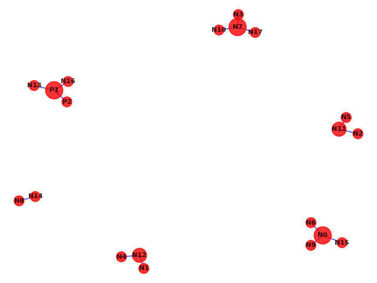
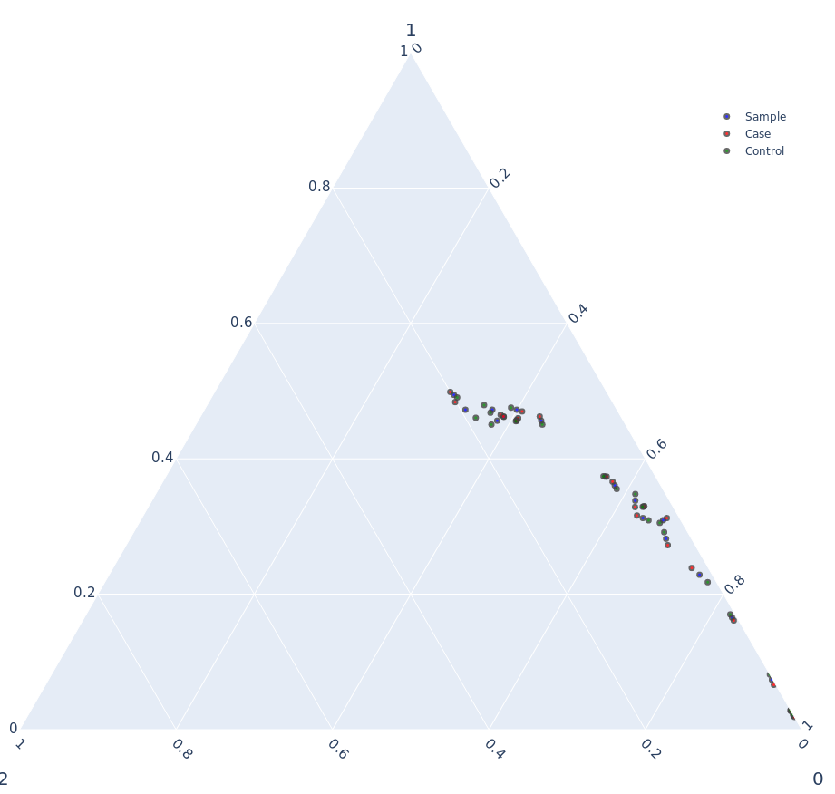
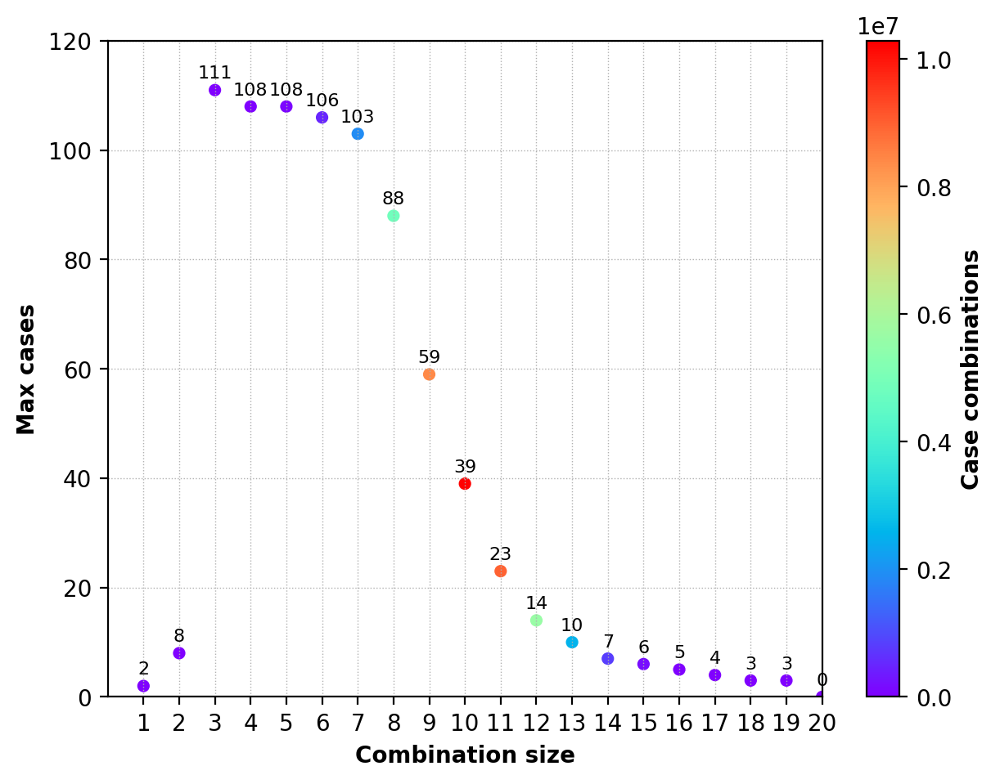

# Statistics
<http://zzz.bwh.harvard.edu/plink/summary.shtml>

## Missing genotype
```
$ plink --bfile mydata --allow-no-sex --missing
# N_MISS (=Number	of	missing	SNPs),
# N_GENO (=Number	of	non-obligatory	missing	genotypes),
# F_MISS (=Proportion	of	missing	SNPs).
$ less plink.lmiss

 CHR  SNP   N_MISS   N_GENO   F_MISS
   1   N0        0     1600        0
   1   N1        0     1600        0
   1   N2        0     1600        0
   1   N3        0     1600        0
   1   N4        0     1600        0
   1   N5        0     1600        0
   1   N6        0     1600        0
   1   N7        0     1600        0
   1   N8        0     1600        0
   1   N9        1     1600   0.0113
   1  N10        0     1600        0
   1  N11        1     1600  0.00565
   1  N12        0     1600        0
   1  N13        0     1600        0
   1  N14        0     1600        0
   1  N15        0     1600        0
   1  N16        0     1600        0
   1  N17        0     1600        0
   1   P1        0     1600        0
   1   P2        0     1600        0

$ less plink.imiss

       FID        IID MISS_PHENO   N_MISS   N_GENO   F_MISS
     ind_1      ind_1          N        0       20        0
     ind_2      ind_2          N        0       20        0
     ind_3      ind_3          N        0       20        0
     ind_4      ind_4          N        1       20 0.001074
     ind_5      ind_5          N        0       20        0
     ind_6      ind_6          N        0       20        0
     ind_7      ind_7          N        0       20        0
     ind_8      ind_8          N        1       20 0.001074
     ind_9      ind_9          N        0       20        0
    ind_10     ind_10          N        0       20        0
...
```

```
$ plink --bfile mydata --allow-no-sex --test-missing
$ less plink.missing

 CHR    SNP     F_MISS_A     F_MISS_U            P
   1     N9            0       0.0113        0.537
   1    N11            0      0.00565            1
```

The way to exclude 10% missing genotype (default):
```
$ plink --file mydata --mind 0.1 --recode --out cleaned

cleaned.ped # generated
cleaned.map # generated
```
or 
```
$ plink --file data --mind 0.1 --make-bed --out cleaned

cleaned.bed # generated
cleaned.bim # generated
cleaned.fam # generated
```

## Allele Frequency
```
$ plink --bfile mydata --allow-no-sex --freq
$ less plink.frq

 CHR  SNP   A1   A2          MAF  NCHROBS
   1   N0    a    A      0.01031     3200
   1   N1    a    A       0.1306     3200
   1   N2    a    A       0.3644     3200
   1   N3    a    A       0.4447     3200
   1   N4    a    A       0.1772     3200
   1   N5    a    A       0.3956     3200
   1   N6    a    A       0.2512     3200
   1   N7    a    A       0.3644     3200
   1   N8    a    A       0.1734     3200
   1   N9    a    A       0.3809     3200
   1  N10    a    A      0.01406     3200
   1  N11    a    A         0.43     3200
   1  N12    a    A       0.2391     3200
   1  N13    a    A      0.03812     3200
   1  N14    a    A      0.08906     3200
   1  N15    a    A       0.3331     3200
   1  N16    a    A       0.2128     3200
   1  N17    a    A       0.3894     3200
   1   P1    a    A       0.2031     3200
   1   P2    a    A       0.2022     3200
```

Only include SNPs with MAF >= 0.01 (default):
```
$ plink --file mydata --maf 0.01
```

## Hardy-Weinberg Equilibrium
```
$ plink --bfile mydata --allow-no-sex --hardy
# GENO (=Genotype counts: 11/12/22),
# A1 (=Minor allele code),
# A2 (=Major allele code),
# O(HET) (=Observed heterozygosity),
# E(HET) (=Expected heterozygosity),
# P (=H-W p-value).
$ less plink.hwe

 CHR  SNP     TEST   A1   A2                 GENO   O(HET)   E(HET)            P
   1   N0      ALL    a    A            0/33/1567  0.02062  0.02041            1
   1   N0      AFF    a    A             0/15/785  0.01875  0.01857            1
   1   N0    UNAFF    a    A             0/18/782   0.0225  0.02225            1
   1   N1      ALL    a    A          26/366/1208   0.2288   0.2271       0.9122
   1   N1      AFF    a    A           17/191/592   0.2388   0.2417       0.7693
   1   N1    UNAFF    a    A            9/175/616   0.2188   0.2121       0.5037
   1   N2      ALL    a    A          205/756/639   0.4725   0.4632       0.4499
   1   N2      AFF    a    A           98/376/326     0.47   0.4594       0.5388
   1   N2    UNAFF    a    A          107/380/313    0.475   0.4668         0.65
   1   N3      ALL    a    A          316/791/493   0.4944   0.4939            1
   1   N3      AFF    a    A          160/399/241   0.4988   0.4949       0.8864
   1   N3    UNAFF    a    A          156/392/252     0.49   0.4928        0.886
   1   N4      ALL    a    A          36/495/1069   0.3094   0.2916      0.01606
   1   N4      AFF    a    A           13/250/537   0.3125   0.2855     0.006323
   1   N4    UNAFF    a    A           23/245/532   0.3062   0.2976       0.4762
   1   N5      ALL    a    A          255/756/589   0.4725   0.4782       0.6381
   1   N5      AFF    a    A          122/372/306    0.465   0.4736       0.6019
   1   N5    UNAFF    a    A          133/384/283     0.48   0.4824       0.8836
   1   N6      ALL    a    A          103/598/899   0.3738   0.3762       0.7905
   1   N6      AFF    a    A           50/299/451   0.3738   0.3744            1
   1   N6    UNAFF    a    A           53/299/448   0.3738   0.3781        0.779
   1   N7      ALL    a    A          217/732/651   0.4575   0.4632       0.6273
   1   N7      AFF    a    A          106/368/326     0.46   0.4622       0.8787
   1   N7    UNAFF    a    A          111/364/325    0.455   0.4642        0.594
   1   N8      ALL    a    A          52/451/1097   0.2819   0.2867        0.486
   1   N8      AFF    a    A           28/218/554   0.2725   0.2838       0.2621
   1   N8    UNAFF    a    A           24/233/543   0.2912   0.2896            1
   1   N9      ALL    a    A          240/739/621   0.4619   0.4716       0.4265
   1   N9      AFF    a    A          109/365/326   0.4562   0.4632       0.7027
   1   N9    UNAFF    a    A          131/374/295   0.4675    0.479       0.5067
   1  N10      ALL    a    A            0/45/1555  0.02812  0.02773            1
   1  N10      AFF    a    A             0/22/778   0.0275  0.02712            1
   1  N10    UNAFF    a    A             0/23/777  0.02875  0.02834            1
   1  N11      ALL    a    A          310/756/534   0.4725   0.4902       0.1533
   1  N11      AFF    a    A          161/387/252   0.4838   0.4935       0.5673
   1  N11    UNAFF    a    A          149/369/282   0.4612   0.4862       0.1463
   1  N12      ALL    a    A           94/577/929   0.3606   0.3638       0.7312
   1  N12      AFF    a    A           47/293/460   0.3662   0.3667            1
   1  N12    UNAFF    a    A           47/284/469    0.355   0.3609       0.6252
   1  N13      ALL    a    A           2/118/1480  0.07375  0.07334            1
   1  N13      AFF    a    A             2/53/745  0.06625  0.06871       0.2632
   1  N13    UNAFF    a    A             0/65/735  0.08125  0.07795       0.6355
   1  N14      ALL    a    A          10/265/1325   0.1656   0.1623       0.5362
   1  N14      AFF    a    A            5/129/666   0.1612   0.1587       0.8242
   1  N14    UNAFF    a    A            5/136/659     0.17   0.1658       0.6684
   1  N15      ALL    a    A          168/730/702   0.4562   0.4443       0.3111
   1  N15      AFF    a    A           83/370/347   0.4625   0.4456       0.3028
   1  N15    UNAFF    a    A           85/360/355     0.45    0.443       0.6903
   1  N16      ALL    a    A           70/541/989   0.3381    0.335       0.7655
   1  N16      AFF    a    A           39/263/498   0.3288   0.3354       0.5979
   1  N16    UNAFF    a    A           31/278/491   0.3475   0.3347       0.3412
   1  N17      ALL    a    A          258/730/612   0.4562   0.4755       0.1034
   1  N17      AFF    a    A          120/370/310   0.4625   0.4718       0.5999
   1  N17    UNAFF    a    A          138/360/302     0.45    0.479      0.08964
   1   P1      ALL    a    A          75/500/1025   0.3125   0.3237       0.1648
   1   P1      AFF    a    A           42/253/505   0.3162   0.3325       0.1672
   1   P1    UNAFF    a    A           33/247/520   0.3088   0.3147       0.5752
   1   P2      ALL    a    A          60/527/1013   0.3294   0.3226       0.4386
   1   P2      AFF    a    A           29/264/507     0.33   0.3215         0.51
   1   P2    UNAFF    a    A           31/263/506   0.3288   0.3237       0.7433
```

Option to extract P <= 0.1:
```
$ plink --bfile mydata --hwe 0.1 # extract
$ plink --bfile mydata --hwe2 0.1 # asymptotic
```

# Association

<http://zzz.bwh.harvard.edu/plink/anal.shtml>

```
$ plink --bfile mydata --allow-no-sex --assoc --ci 0.95
# A1 (=Minor allele name (based on whole sample)),
# F_A (=Frequency of this allele in cases),
# F_U (=Frequency of this allele in controls),
# A2 (=Major allele name),
# basic allelic	test	chi-square	(1df), an asymptotic p-value, estimated OR for A1, SE (=Standard	error),
# SE (=Standard error),
# L95 (=Lower bound of Confidential Interval of 95%),
# L95 (=Upper bound of Confidential Interval of 95%).
$ less plink.assoc

 CHR  SNP         BP   A1      F_A      F_U   A2        CHISQ            P           OR           SE          L95          U95
   1   N0          0    a 0.009375  0.01125    A       0.2756       0.5996       0.8318       0.3514       0.4177        1.656
   1   N1          1    a   0.1406   0.1206    A        2.818      0.09322        1.193       0.1052       0.9707        1.466
   1   N2          2    a   0.3575   0.3712    A        0.653        0.419       0.9424      0.07347        0.816        1.088
   1   N3          3    a   0.4494     0.44    A       0.2847       0.5936        1.039      0.07115       0.9035        1.194
   1   N4          4    a   0.1725   0.1819    A       0.4823       0.4874       0.9377      0.09262        0.782        1.124
   1   N5          5    a    0.385   0.4062    A        1.511        0.219       0.9149      0.07232        0.794        1.054
   1   N6          6    a   0.2494   0.2531    A       0.0598       0.8068       0.9803      0.08152       0.8355         1.15
   1   N7          7    a   0.3625   0.3662    A      0.04857       0.8256       0.9839      0.07347        0.852        1.136
   1   N8          8    a   0.1712   0.1756    A       0.1068       0.7438       0.9699      0.09338       0.8077        1.165
   1   N9          9    a   0.3644   0.3975    A        3.722      0.05369       0.8689      0.07286       0.7533        1.002
   1  N10         10    a  0.01375  0.01438    A      0.02254       0.8807       0.9559       0.3003       0.5306        1.722
   1  N11         11    a   0.4431   0.4169    A        2.249       0.1337        1.113      0.07144       0.9676         1.28
   1  N12         12    a   0.2419   0.2362    A       0.1391       0.7091        1.031       0.0829       0.8767        1.213
   1  N13         13    a  0.03562  0.04062    A       0.5454       0.4602       0.8724        0.185       0.6071        1.254
   1  N14         14    a  0.08688  0.09125    A       0.1887        0.664       0.9475       0.1242       0.7428        1.209
   1  N15         15    a    0.335   0.3312    A      0.05064        0.822        1.017      0.07501        0.878        1.178
   1  N16         16    a   0.2131   0.2125    A     0.001865       0.9655        1.004      0.08638       0.8474        1.189
   1  N17         17    a   0.3812   0.3975    A       0.8885       0.3459       0.9339      0.07252       0.8102        1.077
   1   P1         18    a   0.2106   0.1956    A        1.112       0.2916        1.097      0.08793       0.9235        1.303
   1   P2         19    a   0.2012   0.2031    A      0.01744       0.8949       0.9884      0.08803       0.8318        1.175
```

```
$ plink --bfile mydata --allow-no-sex --fisher  # with an exact p-value.
$ less plink.assoc.fisher

 CHR  SNP         BP   A1      F_A      F_U   A2            P           OR
   1   N0          0    a 0.009375  0.01125    A        0.727       0.8318
   1   N1          1    a   0.1406   0.1206    A       0.1038        1.193
   1   N2          2    a   0.3575   0.3712    A       0.4405       0.9424
   1   N3          3    a   0.4494     0.44    A       0.6185        1.039
   1   N4          4    a   0.1725   0.1819    A       0.5169       0.9377
   1   N5          5    a    0.385   0.4062    A       0.2329       0.9149
   1   N6          6    a   0.2494   0.2531    A       0.8385       0.9803
   1   N7          7    a   0.3625   0.3662    A       0.8543       0.9839
   1   N8          8    a   0.1712   0.1756    A       0.7794       0.9699
   1   N9          9    a   0.3644   0.3975    A      0.05835       0.8689
   1  N10         10    a  0.01375  0.01438    A            1       0.9559
   1  N11         11    a   0.4431   0.4169    A       0.1432        1.113
   1  N12         12    a   0.2419   0.2362    A       0.7402        1.031
   1  N13         13    a  0.03562  0.04062    A       0.5183       0.8724
   1  N14         14    a  0.08688  0.09125    A       0.7097       0.9475
   1  N15         15    a    0.335   0.3312    A       0.8513        1.017
   1  N16         16    a   0.2131   0.2125    A            1        1.004
   1  N17         17    a   0.3812   0.3975    A       0.3648       0.9339
   1   P1         18    a   0.2106   0.1956    A       0.3122        1.097
   1   P2         19    a   0.2012   0.2031    A       0.9299       0.9884
```

```
$ plink --bfile mydata --allow-no-sex --model
# with an asymptotic p-value, DF (= degrees of freedom)
$ less plink.model

 CHR  SNP   A1   A2     TEST            AFF          UNAFF        CHISQ   DF            P
   1   N0    a    A     GENO       0/15/785       0/18/782           NA   NA           NA
   1   N0    a    A    TREND        15/1585        18/1582       0.2785    1       0.5977
   1   N0    a    A  ALLELIC        15/1585        18/1582       0.2756    1       0.5996
   1   N0    a    A      DOM         15/785         18/782           NA   NA           NA
   1   N0    a    A      REC          0/800          0/800           NA   NA           NA
   1   N1    a    A     GENO     17/191/592      9/175/616        3.638    2       0.1622
   1   N1    a    A    TREND       225/1375       193/1407        2.838    1      0.09205
   1   N1    a    A  ALLELIC       225/1375       193/1407        2.818    1      0.09322
   1   N1    a    A      DOM        208/592        184/616        1.946    1        0.163
   1   N1    a    A      REC         17/783          9/791        2.502    1       0.1137
   1   N2    a    A     GENO     98/376/326    107/380/313       0.6808    2       0.7115
   1   N2    a    A    TREND       572/1028       594/1006       0.6664    1       0.4143
   1   N2    a    A  ALLELIC       572/1028       594/1006        0.653    1        0.419
   1   N2    a    A      DOM        474/326        487/313       0.4403    1        0.507
   1   N2    a    A      REC         98/702        107/693       0.4532    1       0.5008
   1   N3    a    A     GENO    160/399/241    156/392/252        0.358    2       0.8361
   1   N3    a    A    TREND        719/881        704/896        0.285    1       0.5934
   1   N3    a    A  ALLELIC        719/881        704/896       0.2847    1       0.5936
   1   N3    a    A      DOM        559/241        548/252       0.3547    1       0.5514
   1   N3    a    A      REC        160/640        156/644      0.06309    1       0.8017
   1   N4    a    A     GENO     13/250/537     23/245/532        2.852    2       0.2403
   1   N4    a    A    TREND       276/1324       291/1309       0.5136    1       0.4736
   1   N4    a    A  ALLELIC       276/1324       291/1309       0.4823    1       0.4874
   1   N4    a    A      DOM        263/537        268/532      0.07047    1       0.7907
   1   N4    a    A      REC         13/787         23/777        2.842    1      0.09185
   1   N5    a    A     GENO    122/372/306    133/384/283        1.563    2       0.4577
   1   N5    a    A    TREND        616/984        650/950        1.493    1       0.2218
   1   N5    a    A  ALLELIC        616/984        650/950        1.511    1        0.219
   1   N5    a    A      DOM        494/306        517/283        1.421    1       0.2332
   1   N5    a    A      REC        122/678        133/667       0.5645    1       0.4525
   1   N6    a    A     GENO     50/299/451     53/299/448      0.09739    2       0.9525
   1   N6    a    A    TREND       399/1201       405/1195      0.05941    1       0.8074
   1   N6    a    A  ALLELIC       399/1201       405/1195       0.0598    1       0.8068
   1   N6    a    A      DOM        349/451        352/448      0.02285    1       0.8798
   1   N6    a    A      REC         50/750         53/747      0.09339    1       0.7599
   1   N7    a    A     GENO    106/368/326    111/364/325       0.1386    2        0.933
   1   N7    a    A    TREND       580/1020       586/1014      0.04798    1       0.8266
   1   N7    a    A  ALLELIC       580/1020       586/1014      0.04857    1       0.8256
   1   N7    a    A      DOM        474/326        475/325      0.00259    1       0.9594
   1   N7    a    A      REC        106/694        111/689       0.1333    1       0.7151
   1   N8    a    A     GENO     28/218/554     24/233/543       0.9169    2       0.6323
   1   N8    a    A    TREND       274/1326       281/1319        0.105    1       0.7459
   1   N8    a    A  ALLELIC       274/1326       281/1319       0.1068    1       0.7438
   1   N8    a    A      DOM        246/554        257/543       0.3509    1       0.5536
   1   N8    a    A      REC         28/772         24/776        0.318    1       0.5728
   1   N9    a    A     GENO    109/365/326    131/374/295        3.674    2       0.1593
   1   N9    a    A    TREND       583/1017        636/964        3.647    1      0.05618
   1   N9    a    A  ALLELIC       583/1017        636/964        3.722    1      0.05369
   1   N9    a    A      DOM        474/326        505/295        2.529    1       0.1118
   1   N9    a    A      REC        109/691        131/669        2.373    1       0.1235
   1  N10    a    A     GENO       0/22/778       0/23/777           NA   NA           NA
   1  N10    a    A    TREND        22/1578        23/1577      0.02287    1       0.8798
   1  N10    a    A  ALLELIC        22/1578        23/1577      0.02254    1       0.8807
   1  N10    a    A      DOM         22/778         23/777           NA   NA           NA
   1  N10    a    A      REC          0/800          0/800           NA   NA           NA
   1  N11    a    A     GENO    161/387/252    149/369/282        2.578    2       0.2755
   1  N11    a    A    TREND        709/891        667/933        2.171    1       0.1407
   1  N11    a    A  ALLELIC        709/891        667/933        2.249    1       0.1337
   1  N11    a    A      DOM        548/252        518/282         2.53    1       0.1117
   1  N11    a    A      REC        161/639        149/651       0.5761    1       0.4478
   1  N12    a    A     GENO     47/293/460     47/284/469       0.2276    2       0.8924
   1  N12    a    A    TREND       387/1213       378/1222       0.1379    1       0.7103
   1  N12    a    A  ALLELIC       387/1213       378/1222       0.1391    1       0.7091
   1  N12    a    A      DOM        340/460        331/469       0.2079    1       0.6484
   1  N12    a    A      REC         47/753         47/753            0    1            1
   1  N13    a    A     GENO       2/53/745       0/65/735           NA   NA           NA
   1  N13    a    A    TREND        57/1543        65/1535       0.5484    1        0.459
   1  N13    a    A  ALLELIC        57/1543        65/1535       0.5454    1       0.4602
   1  N13    a    A      DOM         55/745         65/735           NA   NA           NA
   1  N13    a    A      REC          2/798          0/800           NA   NA           NA
   1  N14    a    A     GENO      5/129/666      5/136/659       0.2219    2        0.895
   1  N14    a    A    TREND       139/1461       146/1454       0.1927    1       0.6606
   1  N14    a    A  ALLELIC       139/1461       146/1454       0.1887    1        0.664
   1  N14    a    A      DOM        134/666        141/659       0.2152    1       0.6428
   1  N14    a    A      REC          5/795          5/795            0    1            1
   1  N15    a    A     GENO     83/370/347     85/360/355        0.252    2       0.8816
   1  N15    a    A    TREND       536/1064       530/1070      0.05204    1       0.8196
   1  N15    a    A  ALLELIC       536/1064       530/1070      0.05064    1        0.822
   1  N15    a    A      DOM        453/347        445/355       0.1624    1       0.6869
   1  N15    a    A      REC         83/717         85/715       0.0266    1       0.8704
   1  N16    a    A     GENO     39/263/498     31/278/491         1.38    2       0.5016
   1  N16    a    A    TREND       341/1259       340/1260     0.001883    1       0.9654
   1  N16    a    A  ALLELIC       341/1259       340/1260     0.001865    1       0.9655
   1  N16    a    A      DOM        302/498        309/491       0.1297    1       0.7187
   1  N16    a    A      REC         39/761         31/769       0.9561    1       0.3282
   1  N17    a    A     GENO    120/370/310    138/360/302        1.497    2        0.473
   1  N17    a    A    TREND        610/990        636/964       0.8539    1       0.3555
   1  N17    a    A  ALLELIC        610/990        636/964       0.8885    1       0.3459
   1  N17    a    A      DOM        490/310        498/302       0.1694    1       0.6807
   1  N17    a    A      REC        120/680        138/662        1.497    1       0.2211
   1   P1    a    A     GENO     42/253/505     33/247/520        1.372    2       0.5037
   1   P1    a    A    TREND       337/1263       313/1287        1.075    1       0.2999
   1   P1    a    A  ALLELIC       337/1263       313/1287        1.112    1       0.2916
   1   P1    a    A      DOM        295/505        280/520       0.6108    1       0.4345
   1   P1    a    A      REC         42/758         33/767        1.133    1       0.2871
   1   P2    a    A     GENO     29/264/507     31/263/506      0.06955    2       0.9658
   1   P2    a    A    TREND       322/1278       325/1275      0.01781    1       0.8938
   1   P2    a    A  ALLELIC       322/1278       325/1275      0.01744    1       0.8949
   1   P2    a    A      DOM        293/507        294/506     0.002691    1       0.9586
   1   P2    a    A      REC         29/771         31/769      0.06926    1       0.7924
```

```
$ plink --bfile mydata --allow-no-sex --assoc --adjust qq-plot
# UNADJ (=Unadjusted	p-value),
# GC (=Genomic-control	corrected	p-values),
# BONF (=Bonferroni	single-step	adjusted	p-values),
# HOLM (=Holm	(1979)	step-down	adjusted	p-values),
# SIDAK_SS (=Sidak	single-step	adjusted	p-values),
# SIDAK_SD (=Sidak	step-down	adjusted	p-values),
# FDR_BH (=Benjamini	&	Hochberg	(1995)	step-up	FDR	control),
# FDR_BY (=Benjamini	&	Yeku)eli	(2001)	step-up	FDR	control).
$ less plink.assoc.adjusted

 CHR  SNP      UNADJ         GC         QQ       BONF       HOLM   SIDAK_SS   SIDAK_SD     FDR_BH     FDR_BY
   1   N9    0.05369    0.05369      0.025          1          1     0.6684     0.6684     0.8913          1
   1   N1    0.09322    0.09322      0.075          1          1     0.8587     0.8442     0.8913          1
   1  N11     0.1337     0.1337      0.125          1          1     0.9433     0.9245     0.8913          1
   1   N5      0.219      0.219      0.175          1          1     0.9929      0.985     0.9421          1
   1   P1     0.2916     0.2916      0.225          1          1      0.999      0.996     0.9421          1
   1  N17     0.3459     0.3459      0.275          1          1     0.9998     0.9983     0.9421          1
   1   N2      0.419      0.419      0.325          1          1          1     0.9995     0.9421          1
   1  N13     0.4602     0.4602      0.375          1          1          1     0.9997     0.9421          1
   1   N4     0.4874     0.4874      0.425          1          1          1     0.9997     0.9421          1
   1   N3     0.5936     0.5936      0.475          1          1          1          1     0.9421          1
   1   N0     0.5996     0.5996      0.525          1          1          1          1     0.9421          1
   1  N14      0.664      0.664      0.575          1          1          1          1     0.9421          1
   1  N12     0.7091     0.7091      0.625          1          1          1          1     0.9421          1
   1   N8     0.7438     0.7438      0.675          1          1          1          1     0.9421          1
   1   N6     0.8068     0.8068      0.725          1          1          1          1     0.9421          1
   1  N15      0.822      0.822      0.775          1          1          1          1     0.9421          1
   1   N7     0.8256     0.8256      0.825          1          1          1          1     0.9421          1
   1  N10     0.8807     0.8807      0.875          1          1          1          1     0.9421          1
   1   P2     0.8949     0.8949      0.925          1          1          1          1     0.9421          1
   1  N16     0.9655     0.9655      0.975          1          1          1          1     0.9655          1
```
```
$ plink --bfile mydata --allow-no-sex -logistic beta 
# with NMISS (=Number	of	non-missing	individuals	included	in	analysis),
# BETA (=Regression	coefficient	(--linear)	or	odds	ratio	(--logistic)),
# STAT (=Coefficient	t-statistics),
# an asymptotic p-value for t-statistics.
$ less plink.assoc.logistic

 CHR  SNP         BP   A1       TEST    NMISS       BETA         STAT            P
   1   N0          0    a        ADD     1600    -0.1861       -0.527       0.5982
   1   N1          1    a        ADD     1600     0.1778        1.683      0.09247
   1   N2          2    a        ADD     1600    -0.0606      -0.8162       0.4144
   1   N3          3    a        ADD     1600    0.03801       0.5339       0.5934
   1   N4          4    a        ADD     1600   -0.06851      -0.7166       0.4736
   1   N5          5    a        ADD     1600   -0.08788       -1.221       0.2219
   1   N6          6    a        ADD     1600    -0.0198      -0.2438       0.8074
   1   N7          7    a        ADD     1600   -0.01599       -0.219       0.8266
   1   N8          8    a        ADD     1600   -0.03002      -0.3241       0.7459
   1   N9          9    a        ADD     1600    -0.1378       -1.908      0.05637
   1  N10         10    a        ADD     1600   -0.04574      -0.1512       0.8798
   1  N11         11    a        ADD     1600     0.1035        1.473       0.1408
   1  N12         12    a        ADD     1600    0.03066       0.3714       0.7103
   1  N13         13    a        ADD     1600    -0.1373        -0.74       0.4593
   1  N14         14    a        ADD     1600   -0.05508       -0.439       0.6607
   1  N15         15    a        ADD     1600    0.01735       0.2282       0.8195
   1  N16         16    a        ADD     1600    0.00376      0.04333       0.9654
   1  N17         17    a        ADD     1600    -0.0657      -0.9239       0.3556
   1   P1         18    a        ADD     1600    0.08963        1.036          0.3
   1   P2         19    a        ADD     1600   -0.01188      -0.1335       0.8938
```
# LD calculation

<http://zzz.bwh.harvard.edu/plink/ld.shtml>

```
$ plink --bfile mydata --allow-no-sex --r2 dprime inter-chr with-freqs --ld-window-r2 0.005
$ less plink.ld

 CHR_A         BP_A SNP_A      MAF_A  CHR_B         BP_B SNP_B      MAF_B           R2           DP
     1            5   N5   0.395625      1           19   P2   0.202188   0.00611992     0.125729
     1           18   P1   0.203125      1           19   P2   0.202188    0.0279074      0.16754

$ plink --bfile mydata --allow-no-sex --r2 d inter-chr with-freqs --ld-window-r2 0.005
$ less plink.ld

 CHR_A         BP_A SNP_A      MAF_A  CHR_B         BP_B SNP_B      MAF_B           R2            D
     1            5   N5   0.395625      1           19   P2   0.202188   0.00611992    0.0153637
     1           18   P1   0.203125      1           19   P2   0.202188    0.0279074    0.0269938
```
```
$ plink --bfile mydata --allow-no-sex --r2 dprime inter-chr with-freqs --ld-window-r2 0.001
$ less plink.ld

 CHR_A         BP_A SNP_A      MAF_A  CHR_B         BP_B SNP_B      MAF_B           R2           DP
     1            0   N0  0.0103125      1            8   N8   0.173438   0.00173647     0.186997
     1            0   N0  0.0103125      1            9   N9   0.380938   0.00107551     0.409557
     1            0   N0  0.0103125      1           14  N14  0.0890625   0.00101876            1
     1            0   N0  0.0103125      1           16  N16   0.212812   0.00312607     0.284791
     1            0   N0  0.0103125      1           19   P2   0.202188   0.00209782     0.891301
     1            1   N1   0.130625      1            2   N2   0.364375    0.0017376     0.142034
     1            1   N1   0.130625      1            3   N3   0.444688   0.00216632     0.134182
     1            1   N1   0.130625      1            4   N4   0.177188   0.00119479     0.192163
     1            1   N1   0.130625      1           12  N12   0.239062   0.00138925    0.0538967
     1            1   N1   0.130625      1           14  N14  0.0890625   0.00265773     0.063909
     1            1   N1   0.130625      1           17  N17   0.389375   0.00150455     0.079908
     1            2   N2   0.364375      1            6   N6    0.25125   0.00159545    0.0522072
     1            2   N2   0.364375      1           11  N11       0.43   0.00327338    0.0870017
     1            2   N2   0.364375      1           17  N17   0.389375   0.00105073    0.0341876
     1            2   N2   0.364375      1           19   P2   0.202188   0.00104851    0.0487004
     1            3   N3   0.444688      1            8   N8   0.173438    0.0015051    0.0757893
     1            3   N3   0.444688      1           10  N10  0.0140625   0.00213762     0.432614
     1            3   N3   0.444688      1           16  N16   0.212812   0.00136734    0.0794732
     1            3   N3   0.444688      1           19   P2   0.202188   0.00175142    0.0743921
     1            4   N4   0.177188      1            6   N6    0.25125   0.00120982     0.129392
     1            4   N4   0.177188      1            9   N9   0.380938   0.00134834     0.100873
     1            4   N4   0.177188      1           12  N12   0.239062   0.00206632     0.174764
     1            4   N4   0.177188      1           14  N14  0.0890625   0.00104996    0.0480894
     1            4   N4   0.177188      1           17  N17   0.389375   0.00364646     0.162957
     1            5   N5   0.395625      1            9   N9   0.380938   0.00151254    0.0612781
     1            5   N5   0.395625      1           12  N12   0.239062   0.00159792    0.0577013
     1            5   N5   0.395625      1           15  N15   0.333125   0.00149228    0.0442214
     1            5   N5   0.395625      1           16  N16   0.212812    0.0015976     0.062196
     1            5   N5   0.395625      1           19   P2   0.202188   0.00611992     0.125729
     1            7   N7   0.364375      1            8   N8   0.173438   0.00269075     0.149565
     1            7   N7   0.364375      1           11  N11       0.43   0.00107766    0.0376586
     1            7   N7   0.364375      1           17  N17   0.389375   0.00159406     0.042109
     1            8   N8   0.173438      1           17  N17   0.389375   0.00132136    0.0993757
     1            9   N9   0.380938      1           13  N13   0.038125   0.00382624     0.243725
     1           10  N10  0.0140625      1           17  N17   0.389375    0.0023212     0.505188
     1           10  N10  0.0140625      1           18   P1   0.203125   0.00101458     0.134655
     1           11  N11       0.43      1           15  N15   0.333125    0.0019084    0.0536846
     1           11  N11       0.43      1           17  N17   0.389375   0.00196082    0.0638448
     1           13  N13   0.038125      1           16  N16   0.212812   0.00103394    0.0839774
     1           14  N14  0.0890625      1           16  N16   0.212812   0.00109154     0.203216
     1           14  N14  0.0890625      1           17  N17   0.389375   0.00135083    0.0938628
     1           15  N15   0.333125      1           18   P1   0.203125   0.00209955    0.0641442
     1           16  N16   0.212812      1           17  N17   0.389375   0.00168437    0.0630312
     1           16  N16   0.212812      1           19   P2   0.202188   0.00195047    0.0456145
     1           17  N17   0.389375      1           19   P2   0.202188   0.00103718    0.0801131
     1           18   P1   0.203125      1           19   P2   0.202188    0.0279074      0.16754
```

```
$ plink --bfile mydata --allow-no-sex --r2 dprime inter-chr with-freqs --ld-window-r2 0
$ less plink.ld

 CHR_A         BP_A SNP_A      MAF_A  CHR_B         BP_B SNP_B      MAF_B           R2           DP
     1            0   N0  0.0103125      1            1   N1   0.130625  0.000464463    0.0818375
     1            0   N0  0.0103125      1            2   N2   0.364375  8.99385e-05     0.122706
     1            0   N0  0.0103125      1            3   N3   0.444688  0.000447708     0.231636
     1            0   N0  0.0103125      1            4   N4   0.177188  0.000802884     0.598174
     1            0   N0  0.0103125      1            5   N5   0.395625  0.000299645     0.209596
     1            0   N0  0.0103125      1            6   N6    0.25125  0.000278992    0.0947867
     1            0   N0  0.0103125      1            7   N7   0.364375  0.000129386    0.0843693
     1            0   N0  0.0103125      1            8   N8   0.173438   0.00173647     0.186997
     1            0   N0  0.0103125      1            9   N9   0.380938   0.00107551     0.409557
     1            0   N0  0.0103125      1           10  N10  0.0140625  0.000148621            1
     1            0   N0  0.0103125      1           11  N11       0.43  7.23778e-06    0.0228911
     1            0   N0  0.0103125      1           12  N12   0.239062  0.000665512     0.141653
     1            0   N0  0.0103125      1           13  N13   0.038125  0.000636386    0.0492009
     1            0   N0  0.0103125      1           14  N14  0.0890625   0.00101876            1
     1            0   N0  0.0103125      1           15  N15   0.333125  0.000432297     0.288189
     1            0   N0  0.0103125      1           16  N16   0.212812   0.00312607     0.284791
     1            0   N0  0.0103125      1           17  N17   0.389375  0.000770346     0.217123
     1            0   N0  0.0103125      1           18   P1   0.203125  0.000798405     0.139754
     1            0   N0  0.0103125      1           19   P2   0.202188   0.00209782     0.891301
     1            1   N1   0.130625      1            2   N2   0.364375    0.0017376     0.142034
     1            1   N1   0.130625      1            3   N3   0.444688   0.00216632     0.134182
     1            1   N1   0.130625      1            4   N4   0.177188   0.00119479     0.192163
     1            1   N1   0.130625      1            5   N5   0.395625  0.000290652    0.0355849
     1            1   N1   0.130625      1            6   N6    0.25125  0.000894341     0.133186
     1            1   N1   0.130625      1            7   N7   0.364375  0.000412185    0.0396561
     1            1   N1   0.130625      1            8   N8   0.173438  0.000414408     0.114649
     1            1   N1   0.130625      1            9   N9   0.380938  0.000601054    0.0806283
     1            1   N1   0.130625      1           10  N10  0.0140625  0.000327185    0.0587083
     1            1   N1   0.130625      1           11  N11       0.43  5.02405e-05    0.0158823
     1            1   N1   0.130625      1           12  N12   0.239062   0.00138925    0.0538967
     1            1   N1   0.130625      1           13  N13   0.038125  0.000324482    0.0350719
     1            1   N1   0.130625      1           14  N14  0.0890625   0.00265773     0.063909
     1            1   N1   0.130625      1           15  N15   0.333125  0.000879857     0.108272
     1            1   N1   0.130625      1           16  N16   0.212812  0.000476227    0.0292723
     1            1   N1   0.130625      1           17  N17   0.389375   0.00150455     0.079908
     1            1   N1   0.130625      1           18   P1   0.203125  0.000457656    0.0278642
     1            1   N1   0.130625      1           19   P2   0.202188  0.000359164    0.0971203
     1            2   N2   0.364375      1            3   N3   0.444688  2.98863e-05    0.0080687
     1            2   N2   0.364375      1            4   N4   0.177188  3.69576e-05    0.0173026
     1            2   N2   0.364375      1            5   N5   0.395625  0.000200431    0.0231111
     1            2   N2   0.364375      1            6   N6    0.25125   0.00159545    0.0522072
     1            2   N2   0.364375      1            7   N7   0.364375  5.82913e-06   0.00421167
     1            2   N2   0.364375      1            8   N8   0.173438  0.000172933    0.0379167
     1            2   N2   0.364375      1            9   N9   0.380938  0.000130041    0.0118148
     1            2   N2   0.364375      1           10  N10  0.0140625  0.000399602      0.12673
     1            2   N2   0.364375      1           11  N11       0.43   0.00327338    0.0870017
     1            2   N2   0.364375      1           12  N12   0.239062  4.76657e-05   0.00932601
     1            2   N2   0.364375      1           13  N13   0.038125  8.11514e-05    0.0342591
     1            2   N2   0.364375      1           14  N14  0.0890625  1.14382e-05   0.00818936
     1            2   N2   0.364375      1           15  N15   0.333125  2.98329e-06   0.00185029
     1            2   N2   0.364375      1           16  N16   0.212812  0.000106566    0.0262227
     1            2   N2   0.364375      1           17  N17   0.389375   0.00105073    0.0341876
     1            2   N2   0.364375      1           18   P1   0.203125  0.000938773    0.0459481
     1            2   N2   0.364375      1           19   P2   0.202188   0.00104851    0.0487004
     1            3   N3   0.444688      1            4   N4   0.177188  0.000167608    0.0311761
     1            3   N3   0.444688      1            5   N5   0.395625  0.000127855    0.0125063
     1            3   N3   0.444688      1            6   N6    0.25125  1.75507e-06   0.00204655
     1            3   N3   0.444688      1            7   N7   0.364375  2.64163e-05   0.00607465
     1            3   N3   0.444688      1            8   N8   0.173438    0.0015051    0.0757893
     1            3   N3   0.444688      1            9   N9   0.380938  0.000124643     0.012736
     1            3   N3   0.444688      1           10  N10  0.0140625   0.00213762     0.432614
     1            3   N3   0.444688      1           11  N11       0.43  7.66189e-05   0.00901841
     1            3   N3   0.444688      1           12  N12   0.239062  8.51752e-05       0.0184
     1            3   N3   0.444688      1           13  N13   0.038125  0.000781858     0.125683
     1            3   N3   0.444688      1           14  N14  0.0890625  1.16081e-05    0.0121764
     1            3   N3   0.444688      1           15  N15   0.333125  1.75381e-05   0.00530236
     1            3   N3   0.444688      1           16  N16   0.212812   0.00136734    0.0794732
     1            3   N3   0.444688      1           17  N17   0.389375  7.15784e-06     0.003744
     1            3   N3   0.444688      1           18   P1   0.203125  0.000108528    0.0184647
     1            3   N3   0.444688      1           19   P2   0.202188   0.00175142    0.0743921
     1            4   N4   0.177188      1            5   N5   0.395625  0.000145965    0.0321788
     1            4   N4   0.177188      1            6   N6    0.25125   0.00120982     0.129392
     1            4   N4   0.177188      1            7   N7   0.364375  1.01445e-05   0.00519665
     1            4   N4   0.177188      1            8   N8   0.173438  8.63245e-05    0.0437086
     1            4   N4   0.177188      1            9   N9   0.380938   0.00134834     0.100873
     1            4   N4   0.177188      1           10  N10  0.0140625  4.86309e-05      0.12583
     1            4   N4   0.177188      1           11  N11       0.43  0.000159189    0.0236149
     1            4   N4   0.177188      1           12  N12   0.239062   0.00206632     0.174764
     1            4   N4   0.177188      1           13  N13   0.038125  0.000156984    0.0292044
     1            4   N4   0.177188      1           14  N14  0.0890625   0.00104996    0.0480894
     1            4   N4   0.177188      1           15  N15   0.333125  2.02081e-06   0.00433426
     1            4   N4   0.177188      1           16  N16   0.212812  0.000317612    0.0199683
     1            4   N4   0.177188      1           17  N17   0.389375   0.00364646     0.162957
     1            4   N4   0.177188      1           18   P1   0.203125  8.39521e-06     0.012367
     1            4   N4   0.177188      1           19   P2   0.202188  0.000249608    0.0171392
     1            5   N5   0.395625      1            6   N6    0.25125   0.00068467    0.0365464
     1            5   N5   0.395625      1            7   N7   0.364375  0.000100069      0.01633
     1            5   N5   0.395625      1            8   N8   0.173438  0.000620234    0.0439879
     1            5   N5   0.395625      1            9   N9   0.380938   0.00151254    0.0612781
     1            5   N5   0.395625      1           10  N10  0.0140625  6.98189e-05    0.0864752
     1            5   N5   0.395625      1           11  N11       0.43  4.84599e-06   0.00313261
     1            5   N5   0.395625      1           12  N12   0.239062   0.00159792    0.0577013
     1            5   N5   0.395625      1           13  N13   0.038125  2.33295e-06    0.0062072
     1            5   N5   0.395625      1           14  N14  0.0890625  0.000653473    0.0661453
     1            5   N5   0.395625      1           15  N15   0.333125   0.00149228    0.0442214
     1            5   N5   0.395625      1           16  N16   0.212812    0.0015976     0.062196
     1            5   N5   0.395625      1           17  N17   0.389375  0.000751801    0.0277807
     1            5   N5   0.395625      1           18   P1   0.203125  0.000258788    0.0393819
     1            5   N5   0.395625      1           19   P2   0.202188   0.00611992     0.125729
     1            6   N6    0.25125      1            7   N7   0.364375  0.000790317    0.0367443
     1            6   N6    0.25125      1            8   N8   0.173438  0.000328831    0.0229318
     1            6   N6    0.25125      1            9   N9   0.380938  0.000354788     0.025507
     1            6   N6    0.25125      1           10  N10  0.0140625  2.34578e-05    0.0700088
     1            6   N6    0.25125      1           11  N11       0.43   0.00091058    0.0452451
     1            6   N6    0.25125      1           12  N12   0.239062  0.000128693    0.0117241
     1            6   N6    0.25125      1           13  N13   0.038125  0.000171897    0.0381481
     1            6   N6    0.25125      1           14  N14  0.0890625  2.78651e-05    0.0291436
     1            6   N6    0.25125      1           15  N15   0.333125  2.36397e-05   0.00593223
     1            6   N6    0.25125      1           16  N16   0.212812  0.000985341    0.0349718
     1            6   N6    0.25125      1           17  N17   0.389375  3.40884e-05    0.0126218
     1            6   N6    0.25125      1           18   P1   0.203125  0.000179483    0.0458079
     1            6   N6    0.25125      1           19   P2   0.202188  0.000647251    0.0872419
     1            7   N7   0.364375      1            8   N8   0.173438   0.00269075     0.149565
     1            7   N7   0.364375      1            9   N9   0.380938  0.000601996    0.0254204
     1            7   N7   0.364375      1           10  N10  0.0140625   1.8525e-05    0.0475991
     1            7   N7   0.364375      1           11  N11       0.43   0.00107766    0.0376586
     1            7   N7   0.364375      1           12  N12   0.239062  5.01497e-07    0.0016687
     1            7   N7   0.364375      1           13  N13   0.038125  1.44337e-05    0.0144483
     1            7   N7   0.364375      1           14  N14  0.0890625  0.000269272    0.0693137
     1            7   N7   0.364375      1           15  N15   0.333125  0.000744286    0.0509818
     1            7   N7   0.364375      1           16  N16   0.212812  0.000168939    0.0189269
     1            7   N7   0.364375      1           17  N17   0.389375   0.00159406     0.042109
     1            7   N7   0.364375      1           18   P1   0.203125  0.000130385    0.0171238
     1            7   N7   0.364375      1           19   P2   0.202188  0.000339879    0.0277274
     1            8   N8   0.173438      1            9   N9   0.380938   0.00081243    0.0488111
     1            8   N8   0.173438      1           10  N10  0.0140625  0.000804644       0.1088
     1            8   N8   0.173438      1           11  N11       0.43  6.99992e-06    0.0050166
     1            8   N8   0.173438      1           12  N12   0.239062  0.000699341     0.102998
     1            8   N8   0.173438      1           13  N13   0.038125  9.11273e-06   0.00694564
     1            8   N8   0.173438      1           14  N14  0.0890625  0.000746756    0.0400332
     1            8   N8   0.173438      1           15  N15   0.333125   4.0685e-05    0.0197016
     1            8   N8   0.173438      1           16  N16   0.212812  0.000988257      0.13199
     1            8   N8   0.173438      1           17  N17   0.389375   0.00132136    0.0993757
     1            8   N8   0.173438      1           18   P1   0.203125  0.000393534    0.0218647
     1            8   N8   0.173438      1           19   P2   0.202188  1.09249e-05   0.00363246
     1            9   N9   0.380938      1           10  N10  0.0140625  0.000209563    0.0950845
     1            9   N9   0.380938      1           11  N11       0.43  4.64625e-05    0.0100045
     1            9   N9   0.380938      1           12  N12   0.239062  1.49149e-06    0.0027776
     1            9   N9   0.380938      1           13  N13   0.038125   0.00382624     0.243725
     1            9   N9   0.380938      1           14  N14  0.0890625  0.000205038    0.0583787
     1            9   N9   0.380938      1           15  N15   0.333125  0.000178272     0.014819
     1            9   N9   0.380938      1           16  N16   0.212812  5.59517e-05    0.0183395
     1            9   N9   0.380938      1           17  N17   0.389375  0.000387392    0.0314209
     1            9   N9   0.380938      1           18   P1   0.203125  0.000154354    0.0193033
     1            9   N9   0.380938      1           19   P2   0.202188  0.000134158    0.0180485
     1           10  N10  0.0140625      1           11  N11       0.43    0.0002223     0.143736
     1           10  N10  0.0140625      1           12  N12   0.239062  8.63261e-05    0.0436059
     1           10  N10  0.0140625      1           13  N13   0.038125  0.000528059    0.0383072
     1           10  N10  0.0140625      1           14  N14  0.0890625  0.000980866    0.0819977
     1           10  N10  0.0140625      1           15  N15   0.333125  3.64147e-05    0.0714909
     1           10  N10  0.0140625      1           16  N16   0.212812  2.56131e-05    0.0220335
     1           10  N10  0.0140625      1           17  N17   0.389375    0.0023212     0.505188
     1           10  N10  0.0140625      1           18   P1   0.203125   0.00101458     0.134655
     1           10  N10  0.0140625      1           19   P2   0.202188  1.26688e-06    0.0187212
     1           11  N11       0.43      1           12  N12   0.239062  0.000161567    0.0196966
     1           11  N11       0.43      1           13  N13   0.038125  6.87411e-05    0.0479475
     1           11  N11       0.43      1           14  N14  0.0890625  0.000872452      0.10876
     1           11  N11       0.43      1           15  N15   0.333125    0.0019084    0.0536846
     1           11  N11       0.43      1           16  N16   0.212812  0.000765209    0.0612539
     1           11  N11       0.43      1           17  N17   0.389375   0.00196082    0.0638448
     1           11  N11       0.43      1           18   P1   0.203125  6.08111e-05    0.0177831
     1           11  N11       0.43      1           19   P2   0.202188  0.000263488    0.0371242
     1           12  N12   0.239062      1           13  N13   0.038125  0.000295513      0.15405
     1           12  N12   0.239062      1           14  N14  0.0890625  0.000249644    0.0901521
     1           12  N12   0.239062      1           15  N15   0.333125  0.000399751    0.0252113
     1           12  N12   0.239062      1           16  N16   0.212812  0.000508144    0.0243005
     1           12  N12   0.239062      1           17  N17   0.389375  0.000632754    0.0562004
     1           12  N12   0.239062      1           18   P1   0.203125  0.000139554    0.0417448
     1           12  N12   0.239062      1           19   P2   0.202188  1.12005e-05   0.00372626
     1           13  N13   0.038125      1           14  N14  0.0890625  0.000784602    0.0439929
     1           13  N13   0.038125      1           15  N15   0.333125  0.000106354    0.0732908
     1           13  N13   0.038125      1           16  N16   0.212812   0.00103394    0.0839774
     1           13  N13   0.038125      1           17  N17   0.389375   9.0432e-05    0.0598162
     1           13  N13   0.038125      1           18   P1   0.203125  0.000920573    0.0769432
     1           13  N13   0.038125      1           19   P2   0.202188  0.000705199    0.0671486
     1           14  N14  0.0890625      1           15  N15   0.333125  7.45231e-06   0.00617055
     1           14  N14  0.0890625      1           16  N16   0.212812   0.00109154     0.203216
     1           14  N14  0.0890625      1           17  N17   0.389375   0.00135083    0.0938628
     1           14  N14  0.0890625      1           18   P1   0.203125  0.000924271    0.0490889
     1           14  N14  0.0890625      1           19   P2   0.202188  6.67493e-05    0.0131537
     1           15  N15   0.333125      1           16  N16   0.212812  0.000105878     0.013987
     1           15  N15   0.333125      1           17  N17   0.389375  2.28392e-06    0.0026777
     1           15  N15   0.333125      1           18   P1   0.203125   0.00209955    0.0641442
     1           15  N15   0.333125      1           19   P2   0.202188  0.000152973    0.0173645
     1           16  N16   0.212812      1           17  N17   0.389375   0.00168437    0.0630312
     1           16  N16   0.212812      1           18   P1   0.203125  0.000671612    0.0987218
     1           16  N16   0.212812      1           19   P2   0.202188   0.00195047    0.0456145
     1           17  N17   0.389375      1           18   P1   0.203125  1.07015e-05   0.00811408
     1           17  N17   0.389375      1           19   P2   0.202188   0.00103718    0.0801131
     1           18   P1   0.203125      1           19   P2   0.202188    0.0279074      0.16754
```

```
$ plink --bfile mydata --ld P1 P2 --allow-no-sex

   R-sq = 0.0279074      D' = 0.16754

   Haplotype     Frequency    Expectation under LE
   ---------     ---------    --------------------
          aa      0.068063                0.041069
          Aa      0.134124                0.161118
          aA      0.135062                0.162056
          AA      0.662751                0.635757

   In phase alleles are aa/AA
```
```
P1    : [0.640625 0.3125   0.046875]
P2    : [0.633125 0.329375 0.0375  ]

[ P ]
[[726. 256.  43.]
 [238. 245.  17.]
 [ 49.  26.   0.]]

[ P ]
[[0.45375  0.16     0.026875]
 [0.14875  0.153125 0.010625]
 [0.030625 0.01625  0.      ]]

[ Psi ]
[[0.4055957  0.21100586 0.02402344]
 [0.19785156 0.10292969 0.01171875]
 [0.02967773 0.01543945 0.00175781]]

[ Omega ]
[[ 0.0481543  -0.05100586  0.00285156]
 [-0.04910156  0.05019531 -0.00109375]
 [ 0.00094727  0.00081055 -0.00175781]]
 
D = 0.010649414062499942
```
```
N5      : [589. 756. 255.]
P2      : [1013.  527.   60.]

N5      : [0.368125 0.4725   0.159375]
P2      : [0.633125 0.329375 0.0375  ]

[ P ]
[[399. 170.  20.]
 [472. 255.  29.]
 [142. 102.  11.]]

[ P ]
[[0.249375 0.10625  0.0125  ]
 [0.295    0.159375 0.018125]
 [0.08875  0.06375  0.006875]]

[ Psi ]
[[0.23306914 0.12125117 0.01380469]
 [0.29915156 0.15562969 0.01771875]
 [0.1009043  0.05249414 0.00597656]]

[ Omega ]
[[ 0.01630586 -0.01500117 -0.00130469]
 [-0.00415156  0.00374531  0.00040625]
 [-0.0121543   0.01125586  0.00089844]]

D = 0.007665820312500002
```
```
N4      : [1069.  495.   36.]
P1      : [1025.  500.   75.]

N4      : [0.668125 0.309375 0.0225  ]
P1      : [0.640625 0.3125   0.046875]

[ P ]
[[686. 329.  54.]
 [317. 159.  19.]
 [ 22.  12.   2.]]

[ P ]
[[0.42875  0.205625 0.03375 ]
 [0.198125 0.099375 0.011875]
 [0.01375  0.0075   0.00125 ]]

[ Psi ]
[[0.42801758 0.20878906 0.03131836]
 [0.19819336 0.09667969 0.01450195]
 [0.01441406 0.00703125 0.00105469]]

[ Omega ]
[[ 7.32421875e-04 -3.16406250e-03  2.43164063e-03]
 [-6.83593750e-05  2.69531250e-03 -2.62695313e-03]
 [-6.64062500e-04  4.68750000e-04  1.95312500e-04]]

D = -0.00020996093749994435
```
```
N12     : [929. 577.  94.]
P2      : [1013.  527.   60.]

N12     : [0.580625 0.360625 0.05875 ]
P2      : [0.633125 0.329375 0.0375  ]

[ P ]
[[597. 295.  37.]
 [351. 207.  19.]
 [ 65.  25.   4.]]

[ P ]
[[0.373125 0.184375 0.023125]
 [0.219375 0.129375 0.011875]
 [0.040625 0.015625 0.0025  ]]

[ Psi ]
[[0.3676082  0.19124336 0.02177344]
 [0.2283207  0.11878086 0.01352344]
 [0.03719609 0.01935078 0.00220312]]

[ Omega ]
[[ 0.0055168  -0.00686836  0.00135156]
 [-0.0089457   0.01059414 -0.00164844]
 [ 0.00342891 -0.00372578  0.00029688]]

D = 0.0002583007812500225
```
There are other options.
```
$ plink --bfile mydata --ld rs2840528 rs7545940  # LD between rs2840528 and rx7545940
$ plink --bfile mydata --r2 --ld-window 10 --ld-window-kb 1000 --ld-window-r2 0.2 # these are default values
```

# Epistasis

<http://zzz.bwh.harvard.edu/plink/epi.shtml>

```
$ plink --bfile mydata --epistasis --allow-no-sex
$ less plink.epi.cc

CHR1 SNP1 CHR2 SNP2       OR_INT         STAT            P
   1   P1    1   P2    0.0576579      184.702    4.745e-42
   
$ less plink.epi.cc.summary

 CHR  SNP        N_SIG        N_TOT         PROP   BEST_CHISQ BEST_CHR BEST_SNP
   1   N0            0           18            0        3.289    1   N9
   1   N1            0           19            0        3.486    1  N12
   1   N2            0           19            0        3.511    1  N11
   1   N3            1           19      0.05263        8.947    1   N7
   1   N4            0           19            0        2.694    1  N12
   1   N5            1           19      0.05263        7.606    1  N11
   1   N6            0           19            0        3.183    1   N0
   1   N7            1           19      0.05263        8.947    1   N3
   1   N8            1           19      0.05263        11.93    1  N14
   1   N9            0           19            0        3.289    1   N0
   1  N10            0           18            0        2.215    1   N7
   1  N11            1           19      0.05263        7.606    1   N5
   1  N12            0           19            0        3.486    1   N1
   1  N13            0           19            0        1.812    1   P1
   1  N14            1           19      0.05263        11.93    1   N8
   1  N15            0           19            0        3.274    1   N0
   1  N16            0           19            0        3.507    1   P1
   1  N17            0           19            0        2.206    1   N7
   1   P1            1           19      0.05263        184.7    1   P2
   1   P2            1           19      0.05263        184.7    1   P1
```

# Networks



# Ternary Plot



# Combinations


