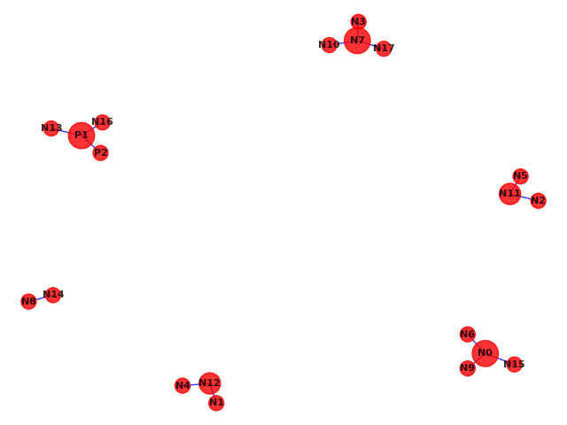
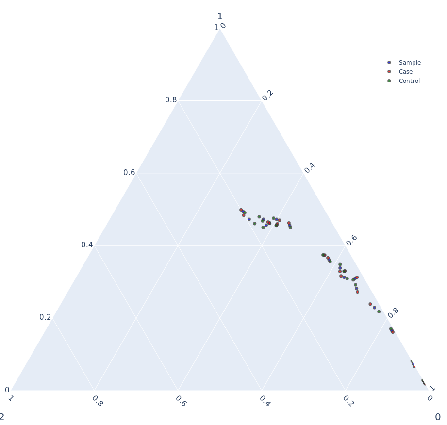

# Association

<http://zzz.bwh.harvard.edu/plink/anal.shtml>

```
$ plink --bfile filename --assoc --allow-no-sex
$ less plink.assoc

 CHR  SNP         BP   A1      F_A      F_U   A2        CHISQ            P           OR
   1   N0          1    A 0.009375  0.01125    R       0.2756       0.5996       0.8318
   1   N1          2    A   0.1406   0.1206    R        2.818      0.09322        1.193
   1   N2          3    A   0.3575   0.3712    R        0.653        0.419       0.9424
   1   N3          4    A   0.4494     0.44    R       0.2847       0.5936        1.039
   1   N4          5    A   0.1725   0.1819    R       0.4823       0.4874       0.9377
   1   N5          6    A    0.385   0.4062    R        1.511        0.219       0.9149
   1   N6          7    A   0.2494   0.2531    R       0.0598       0.8068       0.9803
   1   N7          8    A   0.3625   0.3662    R      0.04857       0.8256       0.9839
   1   N8          9    A   0.1712   0.1756    R       0.1068       0.7438       0.9699
   1   N9         10    A   0.3644   0.3975    R        3.722      0.05369       0.8689
   1  N10         11    A  0.01375  0.01438    R      0.02254       0.8807       0.9559
   1  N11         12    A   0.4431   0.4169    R        2.249       0.1337        1.113
   1  N12         13    A   0.2419   0.2362    R       0.1391       0.7091        1.031
   1  N13         14    A  0.03562  0.04062    R       0.5454       0.4602       0.8724
   1  N14         15    A  0.08688  0.09125    R       0.1887        0.664       0.9475
   1  N15         16    A    0.335   0.3312    R      0.05064        0.822        1.017
   1  N16         17    A   0.2131   0.2125    R     0.001865       0.9655        1.004
   1  N17         18    A   0.3812   0.3975    R       0.8885       0.3459       0.9339
   1   P1         19    A   0.2106   0.1956    R        1.112       0.2916        1.097
   1   P2         20    A   0.2012   0.2031    R      0.01744       0.8949       0.9884
```


# LD calculation

<http://zzz.bwh.harvard.edu/plink/ld.shtml>

```
$ plink --bfile filename --r2 -ld-snp-list snplist.txt --allow-no-sex
$ less plink.ld

 CHR_A         BP_A SNP_A  CHR_B         BP_B SNP_B           R2
     1            1   N0      1            1   N0            1
     1            2   N1      1            2   N1            1
     1            3   N2      1            3   N2            1
     1            4   N3      1            4   N3            1
     1            5   N4      1            5   N4            1
     1            6   N5      1            6   N5            1
     1            7   N6      1            7   N6            1
     1            8   N7      1            8   N7            1
     1            9   N8      1            9   N8            1
     1           10   N9      1           10   N9            1
     1           11  N10      1           11  N10            1
     1           12  N11      1           12  N11            1
     1           13  N12      1           13  N12            1
     1           14  N13      1           14  N13            1
     1           15  N14      1           15  N14            1
     1           16  N15      1           16  N15            1
     1           17  N16      1           17  N16            1
     1           18  N17      1           18  N17            1
     1           19   P1      1           19   P1            1
     1           20   P2      1           20   P2            1
```

There are other options.
```
$ plink --bfile mydata --ld rs2840528 rs7545940  # LD between rs2840528 and rx7545940
$ plink --bfile mydata --r2 --ld-window 10 --ld-window-kb 1000 --ld-window-r2 0.2 # these are default values
```

# Epistasis

<http://zzz.bwh.harvard.edu/plink/epi.shtml>

```
$ plink --bfile filename --epistasis --allow-no-sex
$ less plink.epi.cc

CHR1 SNP1 CHR2 SNP2       OR_INT         STAT            P
   1   P1    1   P2    0.0576579      184.702    4.745e-42
   
$ less plink.epi.cc.summary

 CHR  SNP        N_SIG        N_TOT         PROP   BEST_CHISQ BEST_CHR BEST_SNP
   1   N0            0           18            0        3.289    1   N9
   1   N1            0           19            0        3.486    1  N12
   1   N2            0           19            0        3.511    1  N11
   1   N3            1           19      0.05263        8.947    1   N7
   1   N4            0           19            0        2.694    1  N12
   1   N5            1           19      0.05263        7.606    1  N11
   1   N6            0           19            0        3.183    1   N0
   1   N7            1           19      0.05263        8.947    1   N3
   1   N8            1           19      0.05263        11.93    1  N14
   1   N9            0           19            0        3.289    1   N0
   1  N10            0           18            0        2.215    1   N7
   1  N11            1           19      0.05263        7.606    1   N5
   1  N12            0           19            0        3.486    1   N1
   1  N13            0           19            0        1.812    1   P1
   1  N14            1           19      0.05263        11.93    1   N8
   1  N15            0           19            0        3.274    1   N0
   1  N16            0           19            0        3.507    1   P1
   1  N17            0           19            0        2.206    1   N7
   1   P1            1           19      0.05263        184.7    1   P2
   1   P2            1           19      0.05263        184.7    1   P1
```

# Networks



# Ternary Plot



